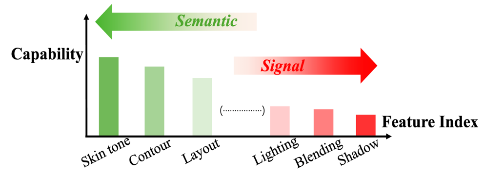

# X2-DFD: eXplainable & eXtendable Deepfake Detection

<p align="left">
  <a href="https://neurips.cc/" target="_blank"></a>
  <a href="#citation"></a>
  
  <a href="https://github.com/haotian-liu/LLaVA" target="_blank"></a>
  
  <a href="https://arxiv.org/abs/2410.06126" target="_blank"></a>
  <a href="#license"></a>
</p>

X2-DFD is a multimodal deepfake detection framework built on LLaVA, designed to be explainable and extendable.
- Explainable: QA-style reasoning with optional scores from traditional detectors, producing structured decisions and rationales.
- Extendable: a simple expert/provider registry to plug in new detectors and fusion strategies (see `src/EXPERTS_GUIDE.md`).

<p align="center">
  
</p>

<p align="center">
  
  
</p>

## Contents
- Quick Start (install, weights, demo)
- Evaluation (one-liner and manual)
- Training Pipeline
- Project Structure
- Config & Environment Variables
- Dataset JSON Schema
- Citation and Acknowledgements
- Security & Data
- Contributing
- License

---

## Quick Start

1) Environment (Conda, Python 3.10 recommended)
```bash
bash install.sh
conda activate X2DFD
```

2) Weights
- Base model: LLaVA-1.5-7B (Hugging Face) → `weights/base/llava-v1.5-7b`
  - Or set env var: `X2DFD_BASE_MODEL=/abs/path/to/llava-v1.5-7b`
- Vision tower: CLIP ViT-L/14-336 → `weights/base/clip-vit-large-patch14-336`

3) Single-Image Demo
```bash
# Base only
python demo.py --image /abs/img.png \
  --model-base weights/base/llava-v1.5-7b

# With LoRA adapter
python demo.py --image /abs/img.png \
  --model-base weights/base/llava-v1.5-7b \
  --adapter-path weights/checkpoints/ckpt/FR/llava-v1.5-7b-lora-[small]
```

---

## Evaluation
- One-liner (LoRA inference + ROC AUC):
```bash
./test.sh
```
  - Inference output: `eval/outputs/infer/latest_run.json`
  - Metrics: `eval/outputs/metrics/auc.json`

- Manual:
```bash
python -m eval.infer.runner --config eval/configs/infer_config.yaml
python -m eval.tools.compute_auc
```

- Question template (example, includes expert score):
```
<image>
Is this image real or fake? And the {alias} score is {score}.
```

---

## Training Pipeline
- End-to-end (annotate → merge → LoRA train → LoRA test):
```bash
./train.sh --run-train [--train-gpus 0,1]
```
- More scripts: `train/` and `train/scripts/`; legacy scripts are archived in `legacy/` (not recommended).

---

## Project Structure
- `src/` core code
  - `diffusion/`: networks, preprocessing, detectors
  - `blending/`: detectors and utils
  - `EXPERTS_GUIDE.md`: registry pattern for experts/providers
- `utils/`: shared helpers (`model_scoring.py`, `lora_inference.py`, `paths.py`, `pipeline_utils.py`)
- `train/`: pipeline + training (`pipeline.py`, `model_train.py`, `configs/`, `outputs/`)
- `eval/`: inference + metrics (`infer/runner.py`, `tools/compute_auc.py`, `configs/`, `outputs/`)
- `datasets/`: raw images, metadata JSONs, prompts; `weights/`: model files (not tracked)

Coding style: Python 3.10, PEP 8, 4-space indent; prefer type hints and f-strings; keep functions small with minimal side effects.

---

## Config & Environment Variables
- Common env vars (see `utils/paths.py`):
  - `X2DFD_BASE_MODEL`, `X2DFD_WEIGHTS`, `X2DFD_OUTPUT`, `X2DFD_DATASETS`
- GPU auto-detection; override with `GPUS` or `--train-gpus`.
- All outputs record absolute image paths. Dataset JSON may use a top-level `Description` as image root.

---

## Dataset JSON Schema
Minimal dataset JSON example:
```json
{
  "Description": "/abs/path/to/datasets/raw/images/FaceForensics++",
  "images": [
    { "image_path": "manipulated_sequences/Deepfakes/c23/00001.png" },
    { "image_path": "/abs/path/to/another/image.png" }
  ]
}
```
- If `Description` is missing, every `images[].image_path` must be absolute.
- Outputs (evaluation/inference/annotation) always contain absolute image paths.

---

<a id="citation"></a>

## Citation
If you find this repository useful, please cite:

```bibtex
@article{chen2024x2,
  title={X2-dfd: A framework for explainable and extendable deepfake detection},
  author={Chen, Yize and Yan, Zhiyuan and Cheng, Guangliang and Zhao, Kangran and Lyu, Siwei and Wu, Baoyuan},
  journal={arXiv preprint arXiv:2410.06126},
  year={2024}
}
```

A `CITATION.cff` file is also provided for GitHub's "Cite this repository" widget.

---

## Acknowledgements
- We thank the LLaVA team for their open-source project and training/inference pipeline:
  https://github.com/haotian-liu/LLaVA
- Parts of this repo build on community practices (fusion, detectors, training tools). If we missed an attribution, please open an issue.

---

## Security & Data
- Do NOT commit datasets or weights; keep them locally under `datasets/` and `weights/`.
- Before releasing, remove any private or restricted samples.

---

## Contributing
- We follow Conventional Commits: `feat|fix|docs|refactor|test|chore` with scoped modules, e.g., `feat(diffusion): batched detector infer`.
- PRs should include: clear description, reproduction commands, AUC before/after (paths to `eval/outputs`), related issues, and focused diffs.

---

<a id="license"></a>

## License
MIT License. See `LICENSE`.

