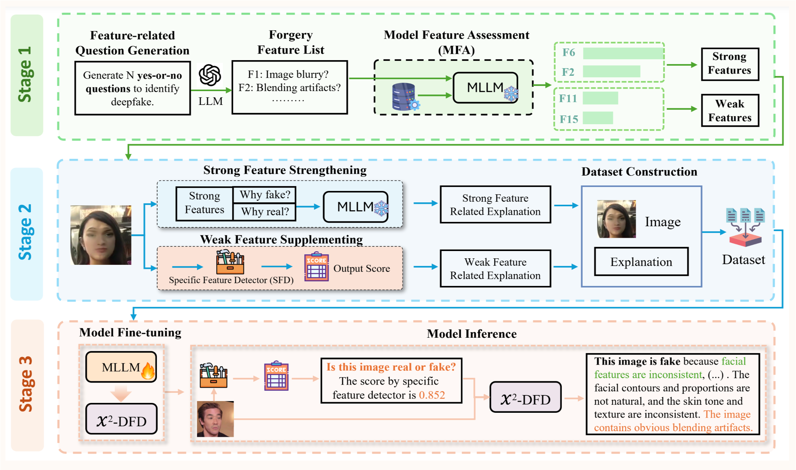
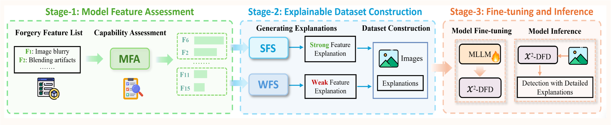

<div align="center">
  <h2>
    
    X2-DFD: A framework for eXplainable and eXtendable Deepfake Detection
  </h2>
</div>

<div align="center">

Yize Chen<sup>1*</sup>, Zhiyuan Yan<sup>3*</sup>, Guangliang Cheng<sup>4</sup>, Kangran Zhao<sup>1</sup>,<br>
Siwei Lyu<sup>5</sup>, Baoyuan Wu<sup>1†</sup>

<br>
<sup>1</sup> The Chinese University of Hong Kong, Shenzhen, Guangdong, 518172, P.R. China &nbsp;&nbsp;·&nbsp;&nbsp;
<sup>3</sup> School of Electronic and Computer Engineering, Peking University, P.R. China<br>
<sup>4</sup> Department of Computer Science, University of Liverpool, Liverpool, L69 7ZX, UK &nbsp;&nbsp;·&nbsp;&nbsp;
<sup>5</sup> Department of Computer Science and Engineering, University at Buffalo, State University of New York, Buffalo, NY, USA

<br>
<sup>*</sup> Equal contribution &nbsp;&nbsp;&nbsp; <sup>†</sup> Corresponding author

</div>

<div align="center">

[](https://neurips.cc/)
[](https://arxiv.org/abs/2410.06126)
[](https://hits.seeyoufarm.com)
[](https://github.com/chenyize111/X2DFD/issues)
[](https://github.com/chenyize111/X2DFD/stargazers)
[](#dataset)
[](#model)
[](#license)

</div>

## 📰 News
- [2025.11.27]: 🎉 X2-DFD was accepted to NeurIPS 2025 (Poster)!
- [2025.11.27]: 🚀 Public release of the X2-DFD codebase and docs.
- [2024.10.XX]: 📝 Preprint available on arXiv: 2410.06126.

##  X2-DFD Overview

X2-DFD is a framework for explainable and extendable deepfake detection. It couples artifact-aware expert signals with a vision-language model to produce both a binary verdict (real/fake) and concise, human-readable explanations.

- **Experts as weak signals.** The framework integrates “experts” (e.g., blending- and diffusion-based detectors). Their scores are rendered into the question to ground the model’s reasoning on concrete artifacts.
- **Explainable annotation + LoRA.** A base LLaVA model generates rationale-style annotations, and a lightweight **LoRA** adapter is fine-tuned for the detection task.
- **Registry pattern.** Plug in new experts/providers and fusion strategies without touching the core pipeline (see `src/EXPERTS_GUIDE.md`).
- **Standardized I/O.** JSON schemas and strict path rules ensure reproducible data handling and evaluation across datasets.

<div align="center">

</div>

##  Contributions

- **Unified framework.** Combines artifact experts with a multimodal LLM, delivering accurate real/fake decisions and natural-language explanations.
- **Plug-and-play pipeline.** Expert/provider registry and staged pipeline (explainable annotation → weak-signal merge → LoRA training) streamline extension and reuse.
- **Consistent evaluation.** Dataset-style JSONs, absolute-path outputs, and one-line ROC AUC computation.

## 🛠️ Installation

1) Environment (Conda, Python 3.10 recommended)
```bash
bash install.sh
conda activate X2DFD
```

2) **Weights**
- **Base model:** LLaVA-1.5-7B (Hugging Face) → `weights/base/llava-v1.5-7b`
  - Or set env var: `X2DFD_BASE_MODEL=/abs/path/to/llava-v1.5-7b`
- **Vision tower:** CLIP ViT-L/14-336 → `weights/base/clip-vit-large-patch14-336`

3) Single-Image Demo
```bash
# Base only
python demo.py --image /abs/img.png \
  --model-base weights/base/llava-v1.5-7b

# With LoRA adapter
python demo.py --image /abs/img.png \
  --model-base weights/base/llava-v1.5-7b \
  --adapter-path weights/checkpoints/ckpt/FR/llava-v1.5-7b-lora-[small]
```

## 📥 Required Weights

| Component | Where to get | Put under (default) | Env var override | Used in |
| --- | --- | --- | --- | --- |
| **LLaVA-1.5-7B (base)** | Hugging Face: liuhaotian/llava-v1.5-7b | `weights/base/llava-v1.5-7b` | `X2DFD_BASE_MODEL` | annotation, training, evaluation |
| **CLIP ViT-L/14-336 (vision tower)** | Hugging Face: openai/clip-vit-large-patch14-336 | `weights/base/clip-vit-large-patch14-336` | `VISION_TOWER` (training), or via config | training |
| **Blending detector (SwinV2-B, 256)** | [Download](XXX) (checkpoint file, e.g., `best_gf.pth`) | `weights/blending_models/best_gf.pth` | set in config `weak_supplies[].weights_path` | weak-signal scores (optional) |
| **Diffusion/aligner detector (ours-sync)** | [Download](XXX) (folder with config/ckpt) | `weights/ours-sync/` | set via `weak_supplies[].weights_dir` + `model: ours-sync` | weak-signal scores (optional) |

Notes
- If you do not have a given expert checkpoint, remove that expert from `weak_supplies` in the config to run base-only.
- Paths can be absolute; environment variables in configs are expanded at runtime.

### 🔀 Optional Expert Variants

We provide two ready-to-use expert settings:

- **Blending-only variant** (lighter): requires only the blending detector checkpoint.
  - Download blending weights: [XXX](XXX)
  - Place at: `weights/blending_models/best_gf.pth`
  - Run with blending only (examples):
    - Eval: `python -m eval.infer.runner --config eval/configs/infer_config.yaml --experts blending`
    - Train: `python -m train.pipeline --config train/configs/config.yaml --experts blending --run-train`

- **Blending + Diffusion variant** (stronger): uses both experts.
  - Download blending weights: [XXX](XXX) → `weights/blending_models/best_gf.pth`
  - Download diffusion/aligner package: [XXX](XXX) → `weights/ours-sync/`
  - Eval/Train (default configs already include both experts). You can also pass `--experts blending,diffusion_detector` explicitly.

## 🚀 Usage

### 1) **Evaluation (one-liner)**
- One-liner (LoRA inference + ROC AUC):
```bash
./test.sh
```
  - Inference: `eval/outputs/infer/latest_run.json`
  - Metrics: `eval/outputs/metrics/auc.json`

### 2) **Evaluation (manual)**
```bash
python -m eval.infer.runner --config eval/configs/infer_config.yaml
python -m eval.tools.compute_auc
```

Question template (example, includes expert score):
```
<image>
Is this image real or fake? And the {alias} score is {score}.
```

### 3) **Training (staged)**
End-to-end (annotation → weak merge → LoRA train → LoRA test):
```bash
./train.sh --run-train [--train-gpus 0,1]
```
- More scripts: `train/` and `train/scripts/`; legacy scripts are archived in `legacy/` (not recommended).

Stages mirror our methodology:
- **Stage 2 — Explainable annotation** (base LLaVA generates rationales)
- **Stage 3 — Weak feature supply** (multi-expert artifact scores merged into prompts)
- **Stage 4 — LoRA training** (fine-tune lightweight adapter)

---

## 🧭 Project Structure
- `src/` core code
  - `diffusion/`: networks, preprocessing, detectors
  - `blending/`: detectors and utils
  - `EXPERTS_GUIDE.md`: registry pattern for experts/providers
- `utils/`: shared helpers (`model_scoring.py`, `lora_inference.py`, `paths.py`, `pipeline_utils.py`)
- `train/`: pipeline + training (`pipeline.py`, `model_train.py`, `configs/`, `outputs/`)
- `eval/`: inference + metrics (`infer/runner.py`, `tools/compute_auc.py`, `configs/`, `outputs/`)
- `datasets/`: raw images, metadata JSONs, prompts; `weights/`: model files (not tracked)

Coding style: Python 3.10, PEP 8, 4-space indent; prefer type hints and f-strings; keep functions small with minimal side effects.

---

## ⚙️ Config & Environment Variables
- Common env vars (see `utils/paths.py`):
  - `X2DFD_BASE_MODEL`, `X2DFD_WEIGHTS`, `X2DFD_OUTPUT`, `X2DFD_DATASETS`
- GPU auto-detection; override with `GPUS` or `--train-gpus`.
- All outputs record absolute image paths. Dataset JSON may use a top-level `Description` as image root.

<a id="dataset"></a>

## 📦 Dataset
Minimal dataset JSON example:
```json
{
  "Description": "/abs/path/to/datasets/raw/images/FaceForensics++",
  "images": [
    { "image_path": "manipulated_sequences/Deepfakes/c23/00001.png" },
    { "image_path": "/abs/path/to/another/image.png" }
  ]
}
```
- If `Description` is missing, every `images[].image_path` must be absolute.
- Outputs (evaluation/inference/annotation) always contain absolute image paths.

Tiny sanity JSONs are provided under `datasets/raw/data/test/Tiny_Test/`.
For large-scale evaluation, set `X2DFD_DATASETS` and use `eval/configs/infer_config.example.yaml`.

---

<a id="model"></a>

## 🧠 Model
- **Base:** LLaVA-1.5-7B (`weights/base/llava-v1.5-7b`).
- **Checkpoints:** **LoRA** adapters will be released soon. Paths default to `weights/checkpoints/ckpt/...`.
- You can point to your own adapters via `--adapter-path` or config `model.adapter`.

<a id="citation"></a>

## Citation
If you find this repository useful, please cite:

```bibtex
@article{chen2024x2,
  title={X2-dfd: A framework for explainable and extendable deepfake detection},
  author={Chen, Yize and Yan, Zhiyuan and Cheng, Guangliang and Zhao, Kangran and Lyu, Siwei and Wu, Baoyuan},
  journal={arXiv preprint arXiv:2410.06126},
  year={2024}
}
```

A `CITATION.cff` file is also provided for GitHub's "Cite this repository" widget.

---

## 😄 Acknowledgements
- We thank the **LLaVA** team for their open-source project and training/inference pipeline:
  https://github.com/haotian-liu/LLaVA
- Parts of this repo build on community practices (fusion, detectors, training tools). If we missed an attribution, please open an issue.

---


<a id="license"></a>

## 📝 License
MIT License. See `LICENSE`.
